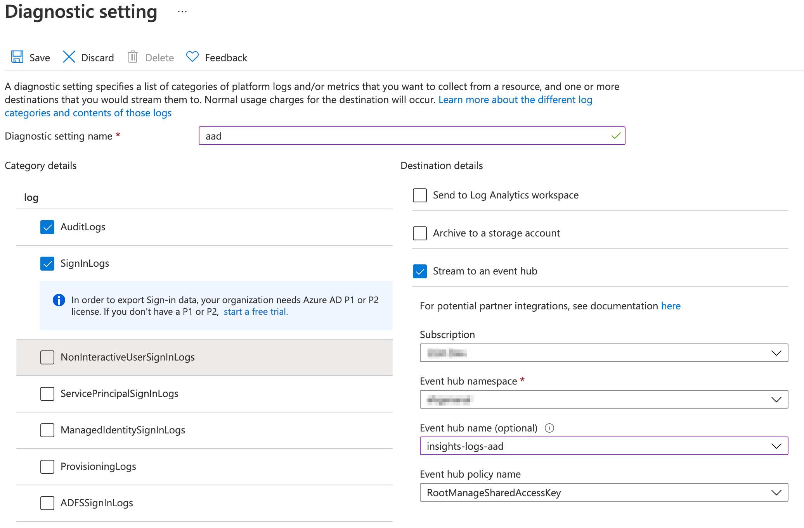

# Sending Azure Active Directory log data to an Event Hub

## Create a common Azure Active Directory Event Hub
* From the Azure Portal, select Event Hubs
* Select your Event Hub Namespace
* Select Event Hubs
* Click the **+ Event Hub** button to create a new Event Hub
* Name the hub `insights-logs-aad`
  * Note: `insights-logs-aad` is the default for the functions, but a different name may be used.  If using a different event hub name, update the function application settings to reflect the correct event hub name.
* Set the number of partitions
  * Note: at least 4 partitions are recommended
* Click the **Create** button

## Send Azure Active Directory Logs to an Event Hub
* From the Azure Portal, select Azure Active Directory
* In the **Monitoring** section, select **Diagnostic settings**
* Choose an existing setting or create a new setting
* Give the diagnostic setting a name
* Select the events to log
  * Note: `NonInteractiveUserSignInLogs` and `ServicePrincipalSignInLogs` are higher volume data sources. The recommended practice is to use a separate diagnostic setting to send these logs to a separate event hub. Specific functions are contained in this repository for `NonInteractiveUserSignInLogs` and `ServicePrincipalSignInLogs`
* Select "Stream to an event hub"
* Select your event hub details
* ***Important:*** select the event hub created in the step above (`insights-logs-aad` by default) 
* Click the Save button

